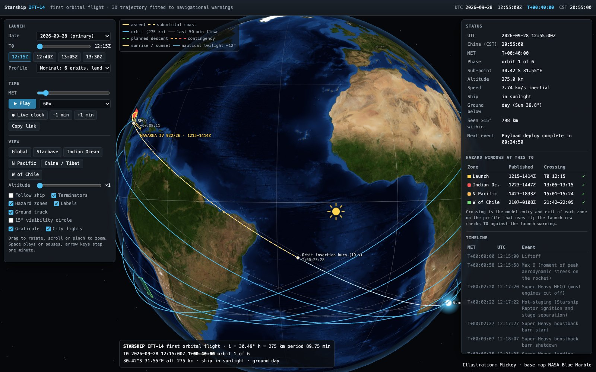

# Starship-IFT14
Starship-IFT14 flight track

Trajectory model of **Starship IFT-14**, the first orbital flight (launch 28 Sep 2026, 12:15:00–13:30:00Z,
alternates daily to 4 Oct), fitted to the published navigational-warning hazard zones, plus maps, TLEs and an
interactive 3D page.



**Interactive page:** open `docs/index.html` through a web server (see below), or the GitHub Pages site once it is
enabled: `https://exoplanet5.github.io/Starship-IFT14/`.

## What is here

| path | content |
|---|---|
| `docs/` | 3D page (three.js, vendored): trajectory, hazard zones, launch-date and T0 shift, MET playback, live clock, major Chinese cities, sunrise/sunset and −12° nautical-twilight terminators, hazard-window check, TLE for any T0 |
| `ift14_navwarning_map.png` | global map: ground track, all hazard zones, insertion burn, contingency deorbit and reentry, planned deorbit burn and landing W of Chile |
| `ift14_china_T0_*.png` | China/Tibet zoom at T0+08:53:00 for T0 12:15, 12:40, 13:05, 13:30Z: burn point, 15° visibility circle and swath, sunrise and nautical-twilight lines |
| `ift14_tles.txt`, `ift14_tles_alternates.txt` | SGP4 TLEs fitted to the model orbit for each T0 (28 Sep, and 29 Sep – 4 Oct) |
| `ift14_summary.md` | fit, timeline, hazard-window analysis, warning verification, TLE notes |
| `navwarning/`, `navwarning_old/` | current and previous NAVAREA / HYDROPAC warnings (KML) |
| `flight-timeline.txt` | official flight timeline used for event times |
| `work/` | Python: fit, maps, TLEs, web export |

## Model in one paragraph

A 275 km circular orbit with J2 secular rates, through Starbase on the south-east branch, is fitted to the
centrelines of the launch, Indian Ocean, North Pacific and South Pacific zones (i = 30.49°, nodal period
89.75 min). SECO at T+00:08:11 leaves the ship on a suborbital ellipse; the 19 s insertion burn at apogee
(T+00:25:28) circularises it. The descent from the deorbit burn at T+08:52:18 is sized to reach entry interface
at the official entry time and landing at T+09:50:30. It is a model built from public warnings, **not official
ephemeris**.

## Run the page locally

```sh
cd docs
python3 -m http.server 8000
# open http://localhost:8000
```

URL parameters restore a view, for example `?date=2026-09-28&t0=13:05&met=08:53:00&br=planned&cam=95,28,1.9&fp=1`.

## Rebuild the products

Python 3.13 with numpy, scipy, shapely, matplotlib, pillow, sgp4, skyfield. Paths inside `work/` are absolute to
the author's machine, and the maps expect the NASA Blue Marble NG `world.topo.bathy.200409.3x21600x10800.jpg`.

```sh
python work/ift14_fit.py            # fit and timeline report
python work/ift14_map.py            # global map
python work/ift14_china.py          # four China maps
python work/ift14_tle.py            # TLEs
python work/ift14_web_export.py --tex   # docs/data/ift14.json and web textures
```

## Credits

Illustration: Mickey. Base map: NASA Blue Marble Next Generation and Black Marble (public domain).
3D rendering: three.js (MIT, `docs/vendor/three/LICENSE`). Code: MIT, see `LICENSE`.
